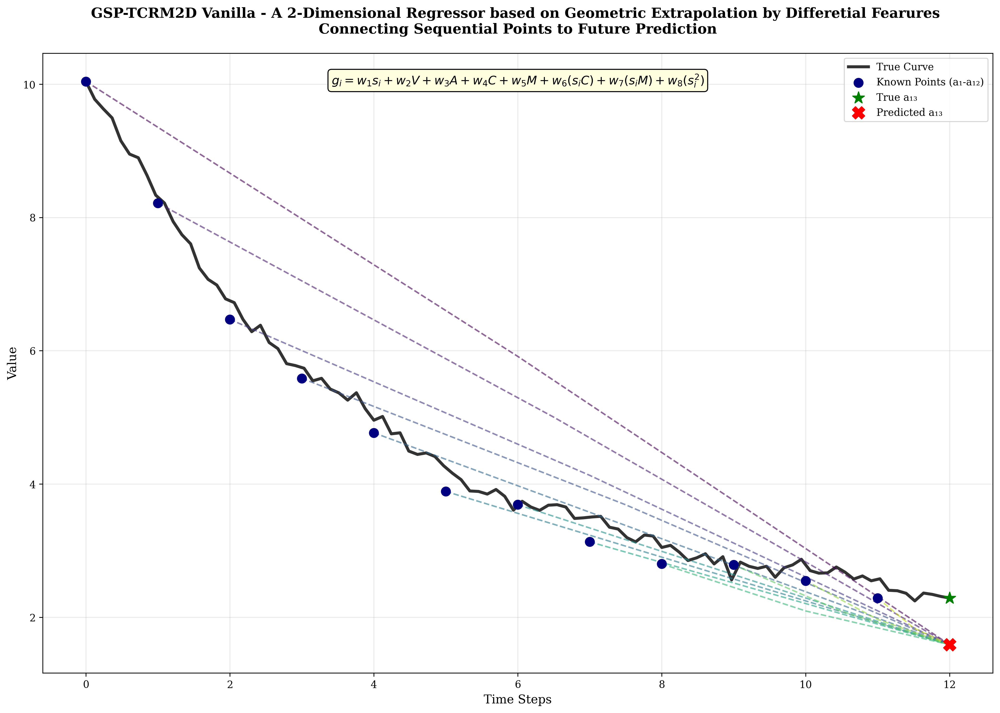
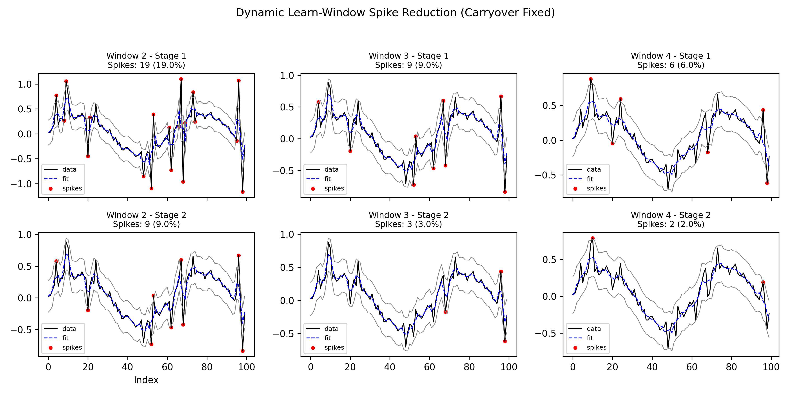
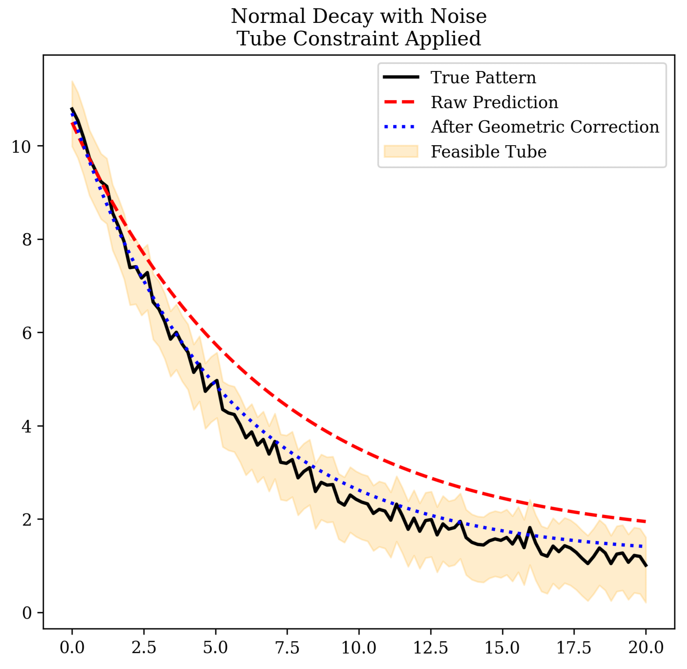
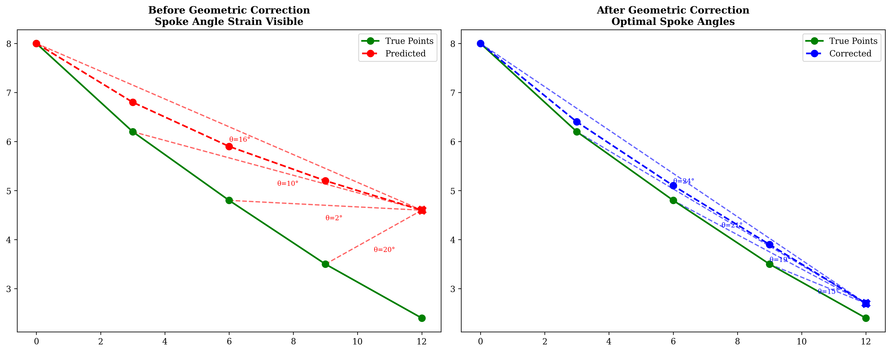
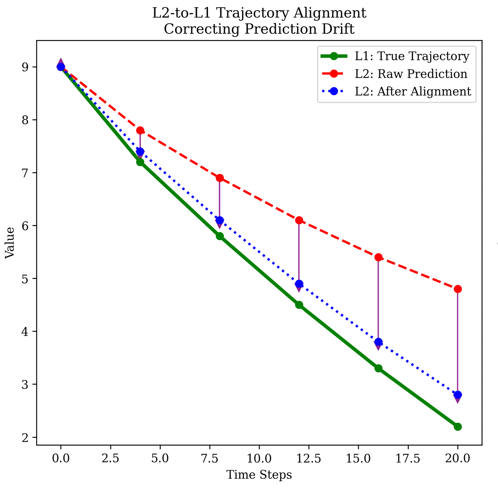
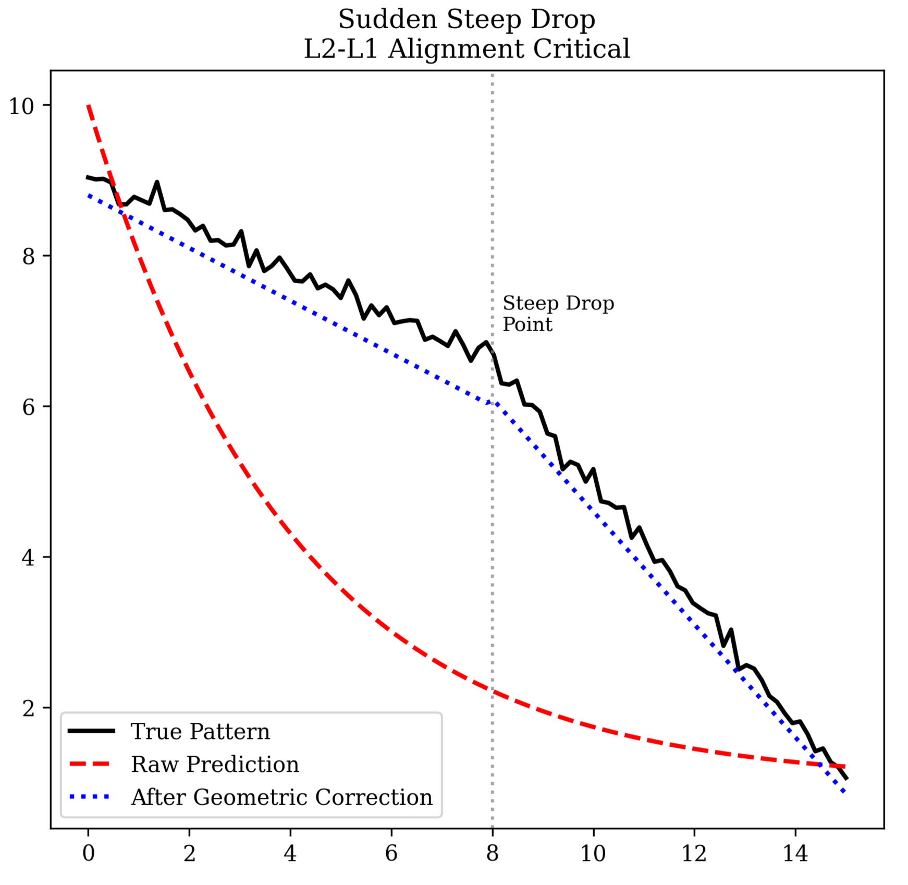
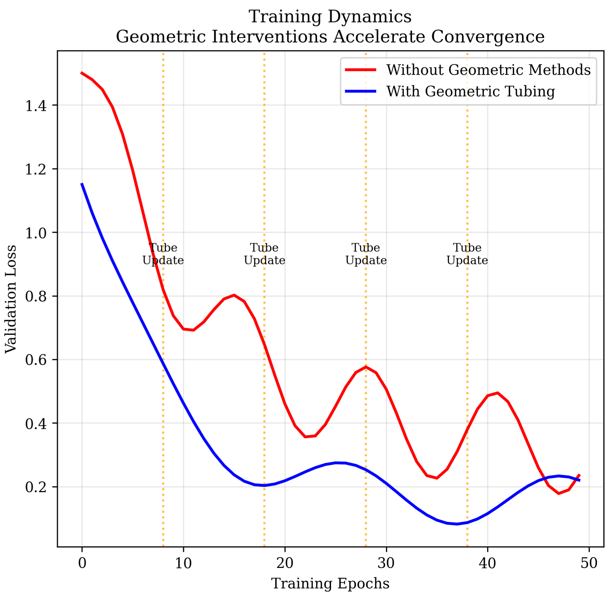

# Geometric Spoke Pull (GSP) – Edge Time-Series Prediction on 2KB MCUs

**by Shakhyar Gogoi — Edge AI & Microcontroller Time-Series Prediction**

# Team EternalzTech (SIH-2025)

- Ankur Kaman  
- Arkajeet Bhattacharjee  
- Nitish Kumar Das  
- Devahuti Phukan  
- Shrutidhara Tasa  
- Shakhyar Gogoi (Repo Owner)

## Author
**Shakhyar Gogoi**  
Independent Researcher & Creator  
Contact: [](wwww.linkedin.com/in/shakhyar-gogoi)

<sub>Preprint Pending — Do Not Redistribute Without Permission</sub>  

### A New Ultra-Light AI Architecture for Soil Moisture Prediction on Low-Power Devices




# Overview

Modern irrigation systems face a common question:

**When will my soil dry again, and how long should irrigation last?**

Traditional sensors only tell “wet” or “dry”.  
They do not predict **future moisture**. This creates two major issues:

- Overwatering → waste of limited water resources
- Underwatering → plant stress and yield loss

Soil moisture decay is **nonlinear**, affected by:
- temperature  
- humidity  
- sunlight  
- soil structure  
- wind  
- plant absorption rate  

Neural networks can learn this, but devices like **Arduino Nano (2 KB RAM)** cannot run such models.

To solve this, our team developed a new **Edge-AI regression architecture**:

# Geometric Spoke Pull (GSP)
A geometry-inspired regression system small enough to run on an Arduino Nano.

We demonstrate it by predicting **soil moisture decay** using only:
- the last 12 moisture readings,
- slope differences,
- tiny learned slope multipliers,
- median-based geometric aggregation.

This project is part of SIH-2025 problem statement **SIH25062** by Team EternalzTech.

# Why This Example?

Moisture decay after irrigation is unpredictable.  
Simple rules like “if below threshold, irrigate” are dangerous because:

- Soil can temporarily appear dry even when plant has enough water.
- Frequent irrigation wastes water in hilly/dry areas.
- Environmental conditions cause irregular decay patterns.

We need a model that:
1. Learns soil behaviour  
2. Predicts future moisture  
3. Runs on extremely limited hardware  

GSP solves this without heavy neural networks.

# What is GSP? (Simple Explanation)

Take the last 12 moisture readings:

a1, a2, ..., a12

Compute slopes (a2-a1, a3-a2, ..., a12-a11).

From each point, imagine a “spoke” stretching forward to where the future point (a13) might be.  
Each spoke is scaled by a tiny learned multiplier weight.

This produces 12 predictions for a13.

These predictions rarely agree.  
But taking their **median** gives a stable, noise-resistant final prediction.

This is the core idea behind Geometric Spoke Pull.

# Why GSP is Unique

- Uses slopes only → no heavy features
- Uses tiny weight-sets → fits in Arduino memory
- Uses hard median → robust to faulty spikes
- Cold-loads weights from SD → no RAM waste
- Learns per-window behaviour → localized intelligence
- Uses adapter to prevent long-term drift

This enables true AI-style learning on microcontrollers.


# Methodology (Technical Section)

## 1. Windowing

Each training graph is split into windows of 12 points:

Window 0: a1..a12 → predict a13  
Window 1: a2..a13 → predict a14  
...  
Window N: a(N+1)..a(N+12) → predict a(N+13)

A 60-point graph → 48 windows.

Each window learns its own tiny weightset.

## 2. Slopes

For each window:

s1 = a2 - a1  
s2 = a3 - a2  
...  
s11 = a12 - a11

Normalize slopes (mean/std or max(|s|)).  
Store normalization parameters.

## 3. Learned Multiplier Slopes

For each slope:

`g_i = w_i * s_norm_i`

11 multipliers per window.  
One extra parameter handles the g12 spoke.

## 4. Candidate Future Points

`y_i = a_i + g_i*(13 - i)`

12 anchors → 12 candidate values for a13.

## 5. Aggregation

Training: soft-median (differentiable)  
Arduino inference: **hard median** for stability

Prediction:

`a_pred = median(y1..y12)`

## 6. Training Losses

True future value: a_true

True spoke slopes:

`g_i_true = (a_true - a_i)/(13 - i)`

Two losses:

`Ly = Huber(a_pred, a_true)`

`Lg = mean( Huber(g_i, g_i_true) )`

Total:

`L = λy*Ly + λg*Lg`

After training, each window has a finalized set of slope multipliers.

## 7. Graph Metadata

Each full graph stores a metadata vector:

- total moisture drop  
- slope mean  
- slope variance  
- decay constant  
- noise level  
- momentum  
- skewness  

Arduino uses this to find the graph that best matches current sensor behaviour.

## 8. Model Storage on SD

Each graph folder contains:

`graph_meta.json `
`windows.bin `         

windows.bin contains 48 compact binary records, each ~20–40 bytes:

int8 weights[11]  
int8 g12_param  
uint16 scale_q  
int16 norm_mean_q  
int16 norm_std_q  

Total storage per graph ≈ 1 KB.

# Inference on Arduino Nano

### Step 1 — Read 12 live points  
Compute slopes & metadata.

### Step 2 — Select the best matching graph  
Using metadata comparison.

### Step 3 — Sequential Replay  
For k = 0..N:

- cold load weightset_k from SD  
- compute slopes  
- normalize  
- `g_i = w_i * s_norm_i `
- compute y_i  
- `a_pred = median(y_i array)`  
- if real sensor reading arrives: use it  
- update adapter (if real reading exists)  
- slide window

### Adapter Logic

A tiny correction prevents drift:

```
δ ← δ + η * (a_true - a_pred)  
a_final = a_pred + δ
```

This keeps predictions aligned with real soil behaviour.

# Advantages

- Runs on Arduino Nano (2KB RAM)  
- Tiny model size  
- No neural network overhead  
- Robust prediction using median  
- SD-card cold loading  
- Explainable behaviour  
- Energy efficient  
- Generalizable to other 1D decay/growth curves

# Example Plots






 

# Limitations & Potential Improvements

- Sequential replay may drift on long horizons  
- Adapter helps but can be improved  
- Graph switching logic can be refined  
- Future: multi-graph blending, time-aware clustering

# License / Preprint Restriction

This is a preprint description of a new AI architecture.  
Redistribution prohibited until official release.

Contact Author: **Shakhyar Gogoi**
[](wwww.linkedin.com/in/shakhyar-gogoi)
